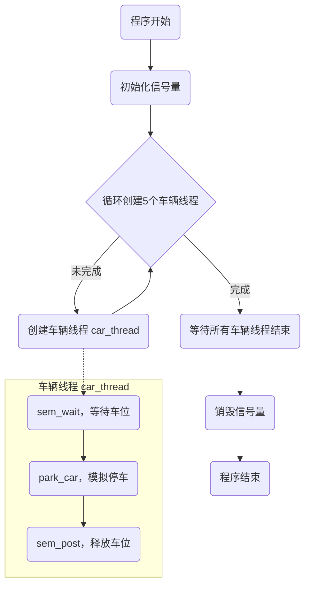

```mermaid
flowchart TD
    Start(程序开始)
    InitSem(初始化信号量)
    ThreadLoop{循环创建5个车辆线程}
    ThreadCreate(创建车辆线程 car_thread)
    WaitAll(等待所有车辆线程结束)
    DestroySem(销毁信号量)
    End(程序结束)

    Start --> InitSem --> ThreadLoop
    ThreadLoop -->|未完成| ThreadCreate
    ThreadCreate --> ThreadLoop
    ThreadLoop -->|完成| WaitAll
    WaitAll --> DestroySem --> End

    subgraph CarThread[车辆线程 car_thread]
        WaitSem(sem_wait，等待车位)
        Park(park_car，模拟停车)
        PostSem(sem_post，释放车位)
        WaitSem --> Park --> PostSem
    end

    ThreadCreate -.-> WaitSem
```